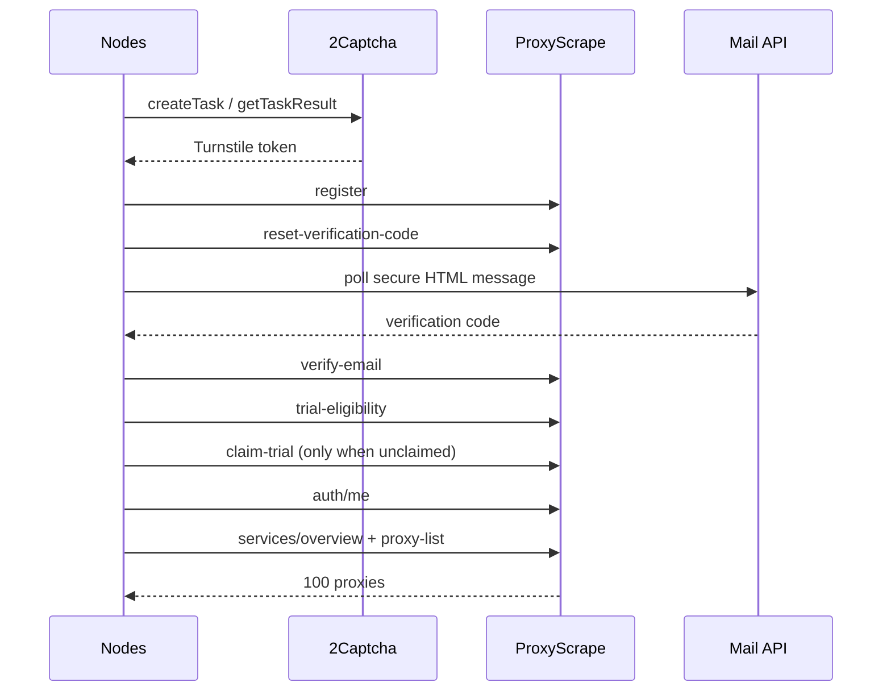

# ProxyScrape onboarding 流程逆向与修复报告

> 分析日期：2026-09-17  
> 授权状态：已授权  
> 工具链：Python, requests, Paramiko, Docker, webpack 静态分析

## 1. 执行摘要

Nodes 原流程假设邮箱验证会自动创建 Premium DC 子账号，但当前
ProxyScrape 前端已将该步骤改为 onboarding 中的显式“领取免费试用”。
已补齐资格检查、幂等领取、`/me` 刷新和代理导出，并修复 mail.com
安全 HTML 正文解析。最终端到端创建 1 个已验证账号，领取免费试用，
导出 100 条唯一 HTTP 代理 URL。

## 2. Scope 摘要

详见 [scope.md](scope.md)。本次仅处理用户指定的 Nodes 和自建邮件服务，
未调用付费结算接口，未在报告中记录任何凭据。

## 3. Evidence

| E-id | source_ref | repro_command | content_hash |
|---|---|---|---|
| E-01 | ProxyScrape `_app` webpack chunk, module `94483` | `rg "94483|claim-trial|trial-eligibility" ps_assets/app.js` | n/a（上游远程资产） |
| E-02 | 部署的注册脚本 | `sha256sum /opt/nodes/current/proxyscrape_register.py` | `94408f4d75346a84c648a7a182bbd246f43f5ff79e51572a2f1d7eb1306d29e6` |
| E-03 | Docker image | `docker image inspect nodes:1216835-yunxin3-onboarding` | n/a（本地镜像标签，实时 digest 由复现命令返回） |
| E-04 | 端到端输出 | `wc -l /opt/nodes/data/node/proxies_20260917_131641.txt` | n/a（含敏感代理凭据） |
| E-05 | 邮件服务安全 HTML 修复 | `sha256sum /opt/yunxin-mail/index.js` | `ba296617b6f163e988642767f79ef34184b69bc1cbd50b74311a529b85efbe15` |

## 4. Findings

| F-id | severity | evidence_ids | confidence | location | status |
|---|---|---|---|---|---|
| F-01 | 中 | E-01 | 高 | onboarding API 调用链 | 已修复 |
| F-02 | 中 | E-05 | 高 | mail.com 正文获取 | 已修复 |
| F-03 | 低 | E-02 | 高 | 注册响应日志 | 已修复（Token 脱敏） |

## 5. 关键调用路径

`P-01` (`path_type=callflow`):



## 6. 修复内容

1. 新增 `trial-eligibility` 检查，已领取时不重复提交。
2. 新增 `claim-trial` 调用，只领取免费 Premium DC trial。
3. 邮箱验证后重新请求 `/me`，不再使用注册时的过期用户快照。
4. mail.com 正文请求改用 `text/vnd.ui.secure-v3+html` 协议。
5. 注册日志将 `access_token` 替换为 `<redacted>`。
6. 账号与代理输出文件创建后强制设为 `0600`。

## 7. 验证

- 10 项单元测试在 Linux 部署镜像内全部通过；Windows 本地跳过
  1 项 POSIX 权限位测试。
- 实际流程的第一个 Turnstile token 被上游拒绝，内置重试使第二个 token 成功。
- 账号记录：1 条，`verified=true`，`trial_claimed=true`，存在 `AccountID`。
- 代理输出：100 行，100 行唯一，全部为 `http://` URL。

## 8. 回滚

```bash
cd /opt/nodes
ln -sfn releases/1216835-yunxin2-2captcha current
sed -i 's/nodes:1216835-yunxin3-onboarding/nodes:1216835-yunxin2-2captcha/' compose.yml
```

## 9. Timeline 摘要

详见 [timeline.md](timeline.md)。
